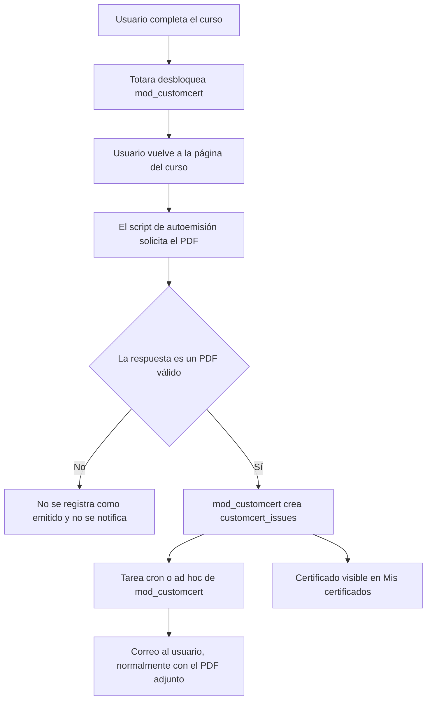

# Flujo de correo al emitir un certificado

## Objetivo

Cuando un usuario termina un curso y el certificado `mod_customcert` queda
disponible, enviarle un correo para informarle de que puede consultarlo en
**Mis certificados**.

## Conclusión

Sí, es posible.

La opción recomendada es utilizar la función nativa **Email students** de la
actividad `mod_customcert`. Esta opción está ligada a la disponibilidad real
del certificado y evita tener que enviar correos desde JavaScript.

El script actual de autoemisión puede mantenerse:

1. El usuario completa el curso.
2. Al volver a la página del curso, `additional-html-footer.js` encuentra el
   certificado desbloqueado.
3. El script solicita `view.php?id=...&downloadown=1`.
4. `mod_customcert` genera el PDF y registra la emisión en
   `customcert_issues`.
5. Si **Email students** está activado, la tarea del servidor envía el correo
   al usuario.
6. El certificado aparece en **Mis certificados**.

El correo lo debe enviar Totara desde el servidor. No se debe intentar enviar
directamente desde `additional-html-footer.js`, porque el navegador no es un
mecanismo fiable ni seguro para gestionar correo, reintentos o duplicados.

## Flujo recomendado



## Opción A: correo nativo de `mod_customcert` — recomendada

### Qué consigue

- El correo se basa en que el certificado está disponible, no solo en que el
  curso figura como completado.
- Normalmente incluye el certificado PDF adjunto y un enlace para verlo.
- El plugin guarda si el certificado ya fue enviado, lo que permite evitar
  duplicados.
- Respeta las restricciones de acceso de la actividad de certificado.

### Configuración en PRE

1. Entrar en un curso de prueba que tenga la actividad de certificado.
2. Activar la edición.
3. Abrir **Editar ajustes** de la actividad `mod_customcert`.
4. Buscar la opción **Email students** / **Enviar certificado por correo a los
   estudiantes**.
5. Seleccionar **Sí**.
6. Mantener las restricciones de acceso actuales para que el certificado solo
   esté disponible cuando el curso se haya completado.
7. Guardar los cambios.
8. Comprobar que el cron de Totara y las tareas programadas o ad hoc de
   `mod_customcert` se ejecutan correctamente.

> Si la opción **Email students** no aparece, hay que comprobar la versión de
> `mod_customcert` instalada y los permisos del rol que configura la actividad.
> La capacidad relacionada es `mod/customcert:manageemailstudents`.

### Prueba funcional

La prueba debe hacerse con un usuario que todavía no tenga emitido el
certificado:

1. Completar el SCORM o las actividades requeridas.
2. Volver a la página principal del curso.
3. Confirmar en la consola que aparece
   `[ivi-autocert] Certificado emitido`.
4. Confirmar que el certificado aparece en **Mis certificados**.
5. Esperar a la ejecución del cron o forzarla en PRE si se dispone de acceso.
6. Confirmar la recepción del correo y revisar también la carpeta de spam.
7. Volver a cargar la página del curso varias veces.
8. Confirmar que no se reciben correos duplicados.

### Despliegue

1. Validar primero un único curso en PRE.
2. Probar los seis idiomas del campus cuando el texto del correo se haya
   personalizado: `es`, `en`, `it`, `pt`, `cs`, `sv`.
3. Activar la opción en un grupo pequeño de cursos.
4. Revisar los logs de correo y de tareas programadas.
5. Aplicarla al resto de actividades `mod_customcert`.
6. Repetir la verificación en PRE2 y después en PRO.

No conviene activar la opción masivamente antes de terminar y revisar las
plantillas, porque podría enviarse un certificado incompleto a usuarios que ya
cumplen las condiciones.

## Opción B: notificación de finalización de curso de Totara

Totara permite crear una notificación con el activador **Learner completed
course**. Es adecuada si se quiere un correo de marca que solo informe de que el
certificado puede consultarse, sin adjuntar necesariamente el PDF.

### Configuración

1. Entrar en el curso.
2. Ir a **Administración del curso > Notificaciones**.
3. Abrir las notificaciones del curso.
4. En el activador **Learner completed course**, crear una notificación.
5. Configurar como destinatario al usuario que completa el curso.
6. Programarla **al producirse el evento**.
7. Habilitar el canal de correo electrónico.
8. Añadir asunto y cuerpo en los seis idiomas.
9. Incluir un enlace a:
   `https://ivirmacampus.com/blocks/mycertificates/list.php`
10. Guardar y probar con un usuario nuevo.

Ejemplo de asunto:

```text
Tu certificado de [course:full_name] ya está disponible
```

Ejemplo de cuerpo:

```text
Hola [recipient:first_name]:

Has completado el curso [course:full_name]. Puedes consultar y descargar tu
certificado desde Mis certificados:

https://ivirmacampus.com/blocks/mycertificates/list.php
```

### Limitación de esta opción

El evento confirma la finalización del curso, pero no confirma directamente
que ya exista el registro en `customcert_issues`. Con el flujo actual, la
emisión depende de que el usuario vuelva a la página del curso y se ejecute el
script de autoemisión. Por tanto, podría existir un pequeño desfase entre el
correo y la generación efectiva del PDF.

## Opción C: correo personalizado exactamente después de la emisión

Si se necesita un correo sin adjunto, totalmente personalizado y enviado solo
después de crear `customcert_issues`, se requiere desarrollo en el servidor:

1. Crear un plugin local de Totara/Moodle.
2. Observar el evento de emisión de `mod_customcert`, normalmente
   `mod_customcert\\event\\issue_created`.
3. Encolar una tarea ad hoc para enviar el correo.
4. Registrar la combinación usuario + certificado como notificada.
5. Hacer el proceso idempotente para impedir duplicados.

Esta opción no puede implementarse de forma robusta únicamente con HTML o con
el JavaScript de `additional-html-footer.js`.

## Recomendación para este proyecto

1. Comprobar en PRE si la actividad muestra **Email students**.
2. Si aparece, activarla en un solo certificado de prueba y mantener el script
   actual de autoemisión.
3. Verificar que el correo se envía una sola vez y que el PDF ya aparece en
   **Mis certificados**.
4. Si el PDF adjunto y el texto estándar son aceptables, extender la opción a
   los demás cursos.
5. Si se necesita un correo visual de marca sin adjunto, usar la notificación
   de curso aceptando el pequeño desfase, o solicitar el plugin de servidor de
   la opción C.

## Fuentes de referencia

- Totara: activadores de notificaciones de curso y actividad:
  <https://totara.help/18/docs/course-and-activity-notification-triggers>
- Totara: configuración de notificaciones de curso:
  <https://totara.help/18/docs/configure-course-and-activity-notifications>
- Totara: placeholders de notificación:
  <https://totara.help/18/docs/en/notification-placeholders>
- `mod_customcert`: configuración y ayuda de **Email students**:
  <https://github.com/mdjnelson/moodle-mod_customcert/blob/main/lang/en/customcert.php>
- `mod_customcert`: formulario de configuración de la actividad:
  <https://github.com/mdjnelson/moodle-mod_customcert/blob/main/mod_form.php>
